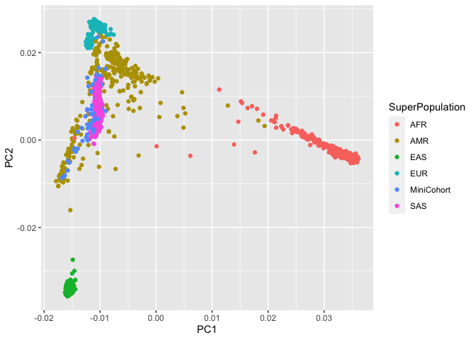
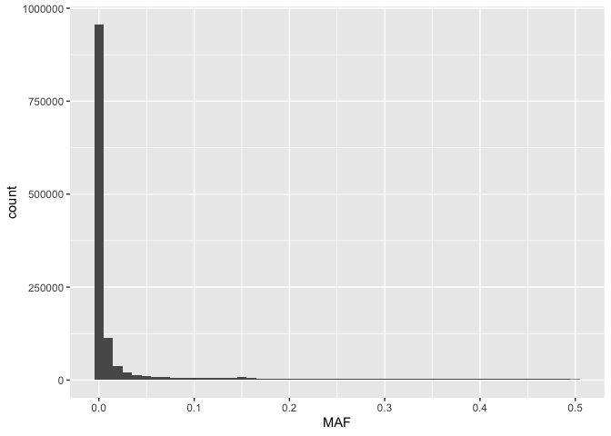
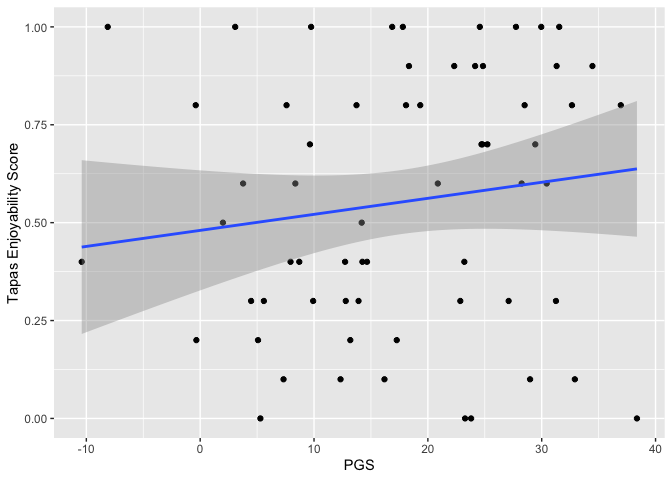

Assignment 7 KEY: PGS
================

-   [Assignment Overview](#assignment-overview)
-   [Getting Ready](#getting-ready)
-   [Genotyping Quality Control](#genotyping-quality-control)
    -   [General QC](#general-qc)
    -   [Global Ancestry Investigation](#global-ancestry-investigation)
    -   [a. PCA-specific QC](#a-pca-specific-qc)
    -   [b. PCA computation](#b-pca-computation)
    -   [c. Visualization](#c-visualization)
-   [Imputation](#imputation)
-   [Polygenic Scores (PGS)](#polygenic-scores-pgs)
    -   [PGS accuracy](#pgs-accuracy)
-   [Authors and contributions](#authors-and-contributions)

# Assignment Overview

In this assignment we will learn about population stratification,
imputation of genotypes, and using polygenic scores. Polygenic scores
(PGSs) can be useful for predicting disease susceptibility. In order to
calculate PGSs, we need two things: GWAS summary statistics (including
effect sizes), and genotypes. Most of the time, only a subset of a
person’s genotypes are actually measured (e.g. via SNP array), and so we
must impute the rest using a matched population of fully genotyped
individuals. This is the goal of Assignment 7.

Throughout the assignment we will be using a Mini Cohort that has
genetic data and some phenotypic variables, together with the 1000
Genomes Project samples. Both datasets are in bfile plink format, which
encompasses 3 files: *.bim, .bed and .fam* all the files can be located
under the following path: */projects/bmeg/A7*

# Getting Ready

In this assignment, you will use the plink tool extensively. A plink
tutorial can be found here:
<https://zzz.bwh.harvard.edu/plink/tutorial.shtml>

``` bash
## Install plink1.9 onto your A1 conda environment:
```

# Genotyping Quality Control

## General QC

Before we can start working on the genetic data, we need to ensure that
the quality is adequate. Thus, we are gonna check the following
measuring for our MiniCohort:

1.  **SNP call rate:** The call rate represents the percentage of
    participants with non-missing data for that SNP. Removing variants
    with a call rate lower than 95% avoids potential wrong calls to be
    included in further analysis

2.  **Minor Allele Frequency:** The minor allele frequency (MAF) echoes
    the less common allele frequency across the population. The MAF
    estimates tend to be more accurate for higher MAFs and the
    population sample size the MAF was based on. If there are too few
    samples representing the rare-allele, is hard to distinguish between
    a true rare-allele and sequencing errors.

3.  **Sample call rate:** Similar to SNP call rate, it allows to filter
    out all samples exceeding 98% missing genetic variants out of all
    the calls.

``` bash
## Using only one run of plink 1.9 (with different flags)
## 1. Filter out -SNPs- with more than 5% missingness
## 2. Filter out -variants- with less than 1% MAF
## 3. Filter out -samples- with more than 2% missingness
## 4. Create an output file in bfile format (which contains the bed, fam and bim files) for the MiniCohort QCed data

#?# Type the command you used below: - 3pt

plink --bfile /projects/bmeg/A7/Mini_cohort --maf --mind 0.02 --geno 0.05 --out minicohort --make-bed

From plink --help
--maf [freq]: Exclude variants with minor allele frequency lower than a threshold (default 0.01).
--geno [val]: Exclude variants with missing call frequencies greater than a threshold (default 0.1).  (Note that the default threshold is only applied if --geno is invoked without a parameter; when --geno is not invoked, no per-variant missing call frequency ceiling is enforced at all.  Other inclusion/exclusion default thresholds work the same way.)
--mind [val]: Exclude samples with missing call frequencies greater than a threshold (default 0.1)

From online: https://zzz.bwh.harvard.edu/plink/thresh.shtml
--geno: Subsequent analyses can be set to automatically exclude SNPs on the basis of missing genotype rate, with the --geno option: the default is to include all SNPS (i.e. --geno 1). To include only SNPs with a 90% genotyping rate (10% missing) use
plink --file mydata --geno 0.1

As with the --maf option, these counts are calculated after removing individuals with high missing genotype rates.
```

## Global Ancestry Investigation

In order to enhance imputation accuracy when dealing with ethnically
diverse cohorts is important to understand the genetic ancestries of the
cohort’s participants. Knowing the ancestral populations will ensure
that the most closely related population is used as a reference for the
imputation. For instance, one would not want to impute haplotypes of an
individual of Yoruban ancestry with a population of East Asians because
many of the haplotypes will differ between the two ancestries, leading
to imputing the wrong variants for the Yoruban person. Hence, we will
analyze the global ancestry of our cohort using Principal Component
Analysis (PCA). PCA is an unsupervised, unbiased way to reduce the
complexity of multidimensional.

## a. PCA-specific QC

We first need to ensure that only the most informative genetic variants
are used in the analysis. To do this, we will:

1.  **Filter out high linkage disequilibrium (LD) regions:** Because
    high LD regions will add redundancy to the PCA (leading to these
    regions dominating top PCs), they need to be removed.

2.  **LD pruning:** Similarly, LD causes redundancy even outside the
    particularly problematic high-LD regions. Thus, we will use
    LD-pruning to identify variants that are in LD, and select one per
    block.

``` bash
## Using only one run of plink 1.9 (with different flags)
## 1. Filter out the high-LD regions contained in the --high_LD_regions_hg19.txt-- file, located in /projects/bmeg/A7/
## 2. Use the --indep-pairwise to do LD prunning with the following parameters:
## - Window size: 200, 
## - Variant Count: 100 
## - VIF (variance inflation factor): 0.2 
#?# Type the command you use to create the Mini Cohort PCA-QCed bfile below: - 1pt

plink --bfile minicohort --exclude high_LD_regions_hg19.txt --indep-pairwise 200kb 100 0.2 --make-bed --out minicohort_filtered

Remove a subset of SNPs:
https://zzz.bwh.harvard.edu/plink/dataman.shtml#exclude
Linkage disequilibrium based SNP pruning:
https://zzz.bwh.harvard.edu/plink/summary.shtml#prune

## Use the output -.prune.in- file to extract only the informative variants and create a new bfile format (bed, fam and bim files) from:
## 1. The General MiniCohort QC bfile created before
## 2. The 1KGP_reference bfile located in /projects/bmeg/A7/

#?# Type the commands you used below: - 3pt
plink --bfile minicohort_filtered --extract minicohort_filtered.prune.in --make-bed --out minicohort_prune

plink --bfile /projects/bmeg/A7/1KGP_reference --extract minicohort_filtered.prune.in --make-bed --out 1KGP_reference_prune
```

## b. PCA computation

To assess the ethnic diversity in our cohort, we will use One-thousand
Genome Project (1KGP) data as a reference for our PCA analysis. These
dataset has genetic information of major continental populations:
Admixed American (AMR), European (EU), Asian (AS) and African (A).

``` bash
## Merge your pruned bfiles of the Mini_cohort and the 1KGP created on the previous step 
## Remember to create a new bfile (.fam, .bed and .bim files) that contains the merged data.
## IMPORTANT TIME CONSTRAINT: This step can take ~15 minutes, so make sure to check the server status before you run it!
#?# Type the command you used below: - 1pt
plink --bfile minicohort_prune --bmerge 1KGP_reference_prune.bed 1KGP_reference_prune.bim 1KGP_reference_prune.fam --make-bed --out merged_minicohort

#?# Perform a PCA analysis in plink on the merged set - 1 pt
plink --bfile merged_minicohort --pca --out minicohort_pca
```

## c. Visualization

``` r
## Copy the PCA .eigenvec file to your computer, together with the samples_info.txt located in /projects/bmeg/A7/

## Load the .eigenvec file onto R, change the column names to: FID, IID, PC1, PC2, PC3, ..., PC20
#?# Type the command you used below: - 1pt
eigenvec <- data.frame(read.table('minicohort_pca.eigenvec'))
new_names <- c('FID','IID','PC1','PC2','PC3','PC4','PC5','PC6','PC7','PC8','PC9','PC10',
                     'PC11','PC12','PC13','PC14','PC15','PC16','PC17','PC18','PC19','PC20')
names(eigenvec)[names(eigenvec) == colnames(eigenvec)] <- new_names
## Load the samples_info.txt file onto R, change the column names to: FID, IID, SuperPopulation, Population
#?# Type the commands you used below: - 1pt
samples_info <- data.frame(read.table('samples_info.txt'))
new_names <- c('IID','FID','SuperPopulation','Population')
names(samples_info)[names(samples_info) == colnames(samples_info)] <- new_names

## Merge the .eigenvec and sample_info data.frames together using the IID column
## Tip: Look into the -merge- function!
#?# Type the command you used below: - 1pt
merged_data <- merge(eigenvec,samples_info, by = "IID")

## Using ggplot create a scatterplot, using: 
## x-axis: PC1
## y-axis: PC2
## color: SuperPopulation - to use the Population information to color the samples and be able to appreciate population structure!
#?# Type the command you used below: 1pt
require(ggplot2)
```

    ## Loading required package: ggplot2

``` r
eig_plot <- ggplot(merged_data, aes(x=PC1,y=PC2, colour = SuperPopulation)) + geom_point()
eig_plot
```

<!-- -->

``` r
#?# Where do the cohort samples fall? Are they all clustered together? - 1 pt
# The minicohort samples fall between the AMR and SAS superpopulation. No they are not clustered together. They are a little bit spread out from each other and mixed into other populations.

#?# Which Population would you use as a reference for imputation?, Why? - 1 pt
# SAS would be a good population to use as a reference for imputation because SAS is nicely clustered and may included some of the minicohorts into imputated sample. 

#?# Do you think looking at the top two PCs is sufficient to tell what population is best? Why/why not? - 2 pt
# PCA results in sorted eigenvalues based on their magnitude. Using the top two principle components allows us to reduces the high dimensionality of the data set and uses it as an optimal orthnormal basis to briefly summarize which population could be the best. However, we may look into using even the third or fourth components as well to gain a deeper understanding of the best population.
```

# Imputation

Imputation of genetic data is a very computationally intensive analysis,
that can take a long time. So we have performed it for you. Using the
chromosome 17 imputation information located in */projects/bmeg/A7/*
under the *Mini_cohort_chr17_imputation_results.info.gz* we will
calculate some post-imputation metrics.

``` r
## Load the Mini_cohort_chr17_imputation_results.info.gz file to your Rstudio environment 
chr_info <- read.table(file = "Mini_cohort_chr17_imputation_results.info", header = TRUE)
## Use the information in the file to answer the following questions. Accompany each of the answers with the code you used to get to them and a brief explanation of your thought process behind.
#?# What is the percentage of imputed SNPs? 0.5 pt
n_imputed <- nrow(subset(chr_info, chr_info$Genotyped == "Imputed"))
n_tot <- nrow(chr_info)
imputed_percentage <- (n_imputed/n_tot)*100
imputed_percentage
```

    ## [1] 99.29754

``` r
# Approximately 99.3% of SNPs are imputed

## The metric of imputation quality is Rsq, this is the estimated value of the squared correlation between imputed and true genotypes. Since true genotypes are not available, this calculation is based on the idea that poorly imputed genotype counts will shrink towards their expectations based on allele frequencies observed in the population (https://genome.sph.umich.edu/wiki/Minimac3_Info_File#Rsq).  An Rsq < 0.3 is often used to flag poorly imputed SNPs. 
#?# What is the percentage of poorly imputed SNPs?
poor_imputed <- (nrow(subset(chr_info, chr_info$Rsq < 0.3))/n_tot)*100
poor_imputed
```

    ## [1] 63.41327

``` r
# approximately 63.4% of all the SNPs in chr17 are poorly imputed.

#?# Create a histogram to visualize the distribution of the MAF - 1 pt
hist_MAF <- ggplot(chr_info, aes(x=MAF)) + geom_histogram(binwidth = 0.01)
hist_MAF
```

<!-- -->

``` r
#?# Which MAF is most frequent? What does that mean? - 1 pt
# The most frequency MAF are ones that has an approximately value of less than 0.01. This means that the alternate allele in the imputed dosage data are not actually frequent in the data.  

#?# What is the maximum MAF? Why is that? - 1 pt
max_MAF <- max(chr_info$MAF)
max_MAF
```

    ## [1] 0.5

``` r
# The maximum MAF is 0.5. In a frequentist approach, the allele has at most half 
```

# Polygenic Scores (PGS)

A GWAS for affinity for tapas (the Spanish appetizer) was performed and
199 SNPs were found significantly associated. The significant SNPs and
their assigned effect sizes are described in the
*Tapas_enjoyability_GWAS_sumStats.txt* file. Thanks to the imputation
performed in our MiniCohort, we were able to obtain the dosages (double
risk alleles=2, one risk allele=1, no risk alleles=0) for each one of
the SNPs associated to the Tapas ‘enjoyability’, described in the
*MiniCohort_Tapas_SNPdosages.txt*.

PGS are calculated by multiplying the effect sizes of each SNP by the
dosage of an individual for those SNP and then adding together all the
effectSize x dosage. The formula is outlined below, where:

-   i: individual of which you are calculating the PGS

-   j: SNP that has been found to be associated to the trait (Tapas
    enjoyability in this case)

-   Beta: Effect size

-   dosage: number of risk alleles the *individual i* has of the *risk
    allele j*? (2,1 or 0)


``` r
## Load to your RStudio:
## 1.  -Tapas_enjoyability_GWAS_sumStats.txt-
## 2.  -MiniCohort_Tapas_SNPdosages.txt- 
## Both are located in the A7 directory on github.

tapas_enjoyability <- data.frame(read.table('Tapas_enjoyability_GWAS_sumStats.txt', header = TRUE))
minicohort_tapas <- data.frame(read.table('MiniCohort_Tapas_SNPdosages.txt', header = TRUE))

## Using the base PRS formula outlined below, calculate the Tapas enjoyability PGS for the individuals in the Mini Cohort 
#?# Include your rationale and the documented code you used - 5pt
minicohort_matrix <- data.matrix(minicohort_tapas[,3:ncol(minicohort_tapas)]) # extract dosage 
tapas_vec <- data.matrix(tapas_enjoyability[1:nrow(tapas_enjoyability),2]) # extract the effect size
PGS_results <- data.frame(PGS = minicohort_matrix %*% tapas_vec) # perform matrix-vector product


#?# Use ggplot to plot the distribution of the Tapas PGS: - 2 pt
## Include the code and the graph in your analysis! 
## Tip: http://www.cookbook-r.com/Graphs/Plotting_distributions_(ggplot2)/
tapas_pgs_plt <- ggplot(PGS_results, aes(x = PGS)) + geom_density() 
tapas_pgs_plt
```

<!-- -->

``` r
#?# What is the distribution of the tapas PGS? - 1pt
# The distribution is a multi-modal distribution. From the plot below, it looks like two Gaussian distributions mixed together in the dataset (most likely two groups of populations hating/enjoying Tapas).
```

## PGS accuracy

``` r
## The Tapas enjoyability was measured in a range of 0-1, with 0 being hating tapas and 1 being completely in love with tapas.
## This tapas likability is captured in the "Tapas_enjoyability" column of the -MiniCohort_Tapas_SNPdosages.txt- file. 
#?# Make a scatterplot with a linear regression line, where x is the Tapas-PGS and y is their actual Tapas enjoyability - 2 pt
## Tip: http://www.sthda.com/english/wiki/ggplot2-scatter-plots-quick-start-guide-r-software-and-data-visualization
tapas_merged <- data.frame(x = PGS_results, y = minicohort_tapas$Tapas_enjoyability)
tapas_plot <- ggplot(tapas_merged, aes(x=PGS,y=y)) + geom_point() + geom_smooth(method = "lm")
tapas_plot + xlab("PGS") + ylab("Tapas Enjoyability Score")
```

    ## `geom_smooth()` using formula 'y ~ x'

<!-- -->

``` r
#?# What is the correlation coefficient between the PGS and Tapas enjoyability? Is Spearman or Pearson correlation more appropriate here? Why? - 3 pt
sp_correlation <- cor(tapas_merged$PGS,tapas_merged$y,method = "spearman")
sp_correlation
```

    ## [1] 0.171456

``` r
# spearman: 0.171456

pear_correlation <- cor(tapas_merged$PGS,tapas_merged$y, method = "pearson")
pear_correlation
```

    ## [1] 0.1409448

``` r
# pearson: 0.1409448

# Looking at the spearman correlation is more appropriate in this case because regardless, we are looking for a monotonic relationship between people who like tapas and their PGS value. This may not be a linear model. Otherwise, then it would be more suitable to use pearson correlation.

#?# How predictive is the PGS for tapas preference? Include in your answer why do you think it is/isn't accurate and what could affect its predicitvity - 2pt 

# From the PGS vs Tapas enjoyability scatter plot, we see a very low correlation between PGS and tapas enjoyability score. First, assuming that the preference is based on a linear relationship, we could see that the linear regression model did not produce a good fit, coupled with a low spearman correlation value. Therefore, the predictivity of tapas preference from PGS is low. 
```

# Authors and contributions

Following completion of your assignment, please fill out this section
with the authors and their contributions to the assignment. If you
worked alone, only the author (e.g. your name and student ID) should be
included.

Authors: Jason Fung (44362648) and Ariel Huynh (73423899)

Contributions: Jason and Ariel worked on separate machines, where Ariel
started the first half of the assignment (General QC and PCA), and Jason
worked on the rest of the assignment (imputation to PGS accuracy).
Online collaboration was done via downloading the Ariel’s QC analysis
files from BCGSC server onto Jason’s machine. Both Jason and Ariel
reviewed the comprehension questions and plots together.
