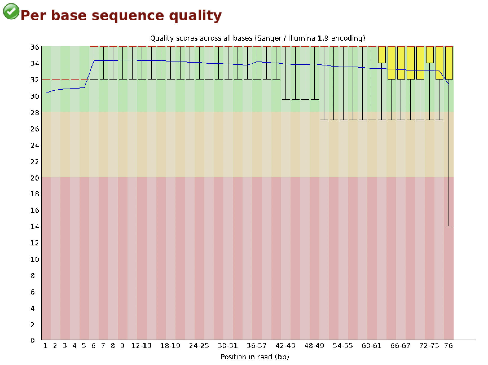
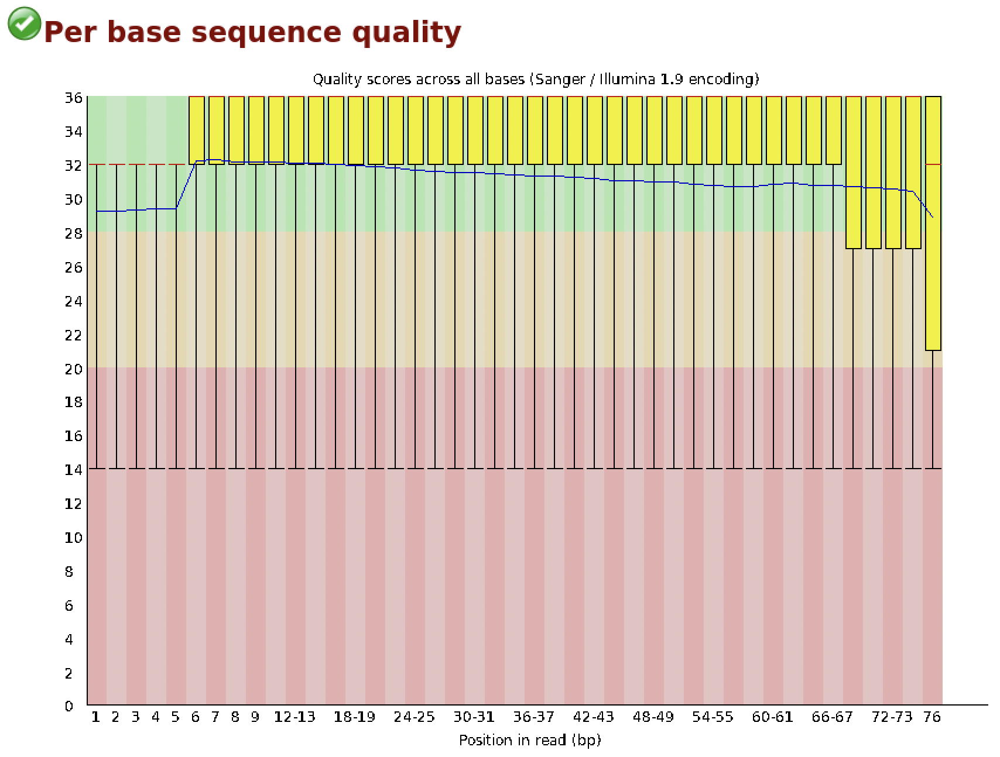
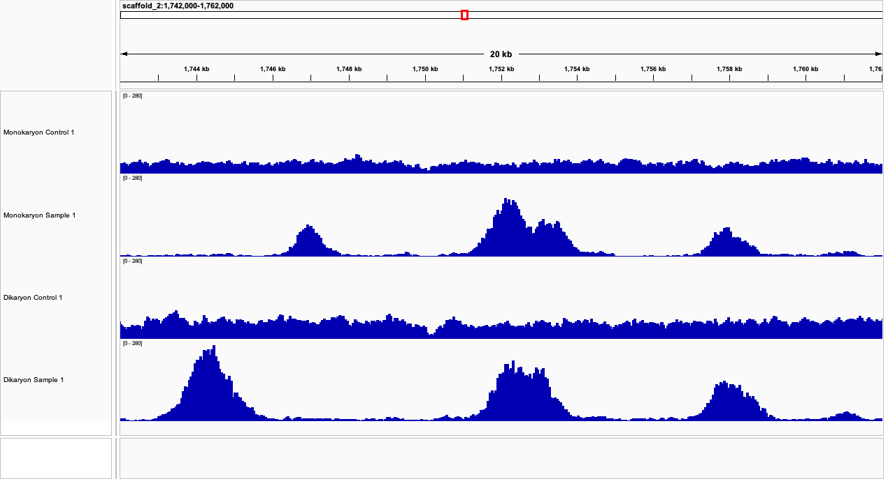
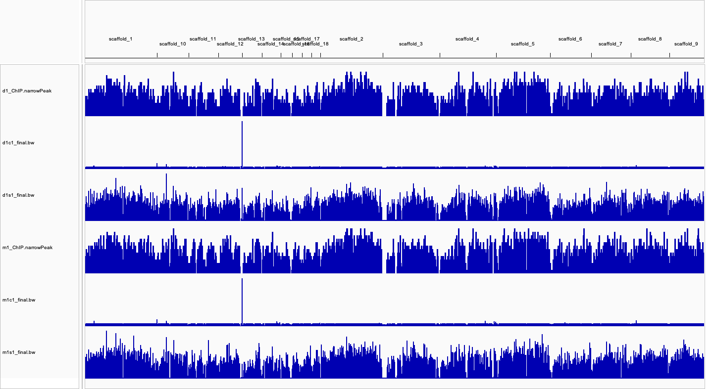
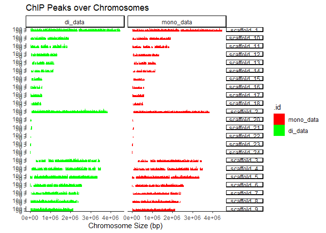

BMEG591 Final Project
================

# Introduction

The fruiting bodies of mushrooms, most conspicuously basidiomycete
fungi, are the sexual structures that produce spores for mushroom
reproduction. The fleshy, spore-bearing bodies are of economic value due
to their use as food \[@kues2000fruiting\]. Moreover, mushrooms can also
produce enzymes used for bioconversions such as lignocellulosic
degradation \[@de2016good\]. In this report we assess the results of
HEK4me2 ChIP-Seq in a model mushroom organism, Schizophyllum commune,
done by Peter Jan Vonk and Robin A. Ohm \[@vonk2021h3k4me2\].

The basidiomycete S. commune can be found on all continents except for
Antarctica, making it one of the most commonly found fungi. It is
predominantly found on fallen deciduous trees, adopting a saprobic
lifestyle by causing white rot \[@schmidt1980variability\]. Thus,
S.commune is an excellent basidiomycete model organism for mushroom
development \[@ohm2010genome\].

In the lab, S.commune has a well-defined lifecycle of 10 days
\[@ohm2010genome\]. The lifecycle of S.commune begins with meiospores
that germinate beneath the surface of the substrate to form monokaryotic
mycelium \[@wosten2006emergence\]. A few days following germination, the
formation of aerial hyphae occurs. Monokaryotic aerial hyphae that
encounter each other fuse, and if alleles of the mating-type loci matA
and matB differ between partners, fertile dikaryons can form. Mushroom
formation begins through the aggregation of aerial dikaryotic hyphae.
Upon the formation of mature fruiting bodies, karyogamy and meiosis
occur in the basidia and the basidiospores are released to give rise to
new monokaryotic mycelium \[@wosten2006emergence\].

Transcriptomics and comparative genomics of S.commune have revealed
elements for a regulatory model of mushroom development
\[@pelkmans2017transcription,@vonk2018role,@krizsan2019transcriptomic\].
However, the role of epigenetic regulation in S.commune remains
undiscovered. In the work completed by Peter Jan Vonk and Robin A. Ohm,
a method for histone ChIP-Seq in S. commune was developed and the
distribution of H3K4me2 in the genome was mapped during monokaryotic and
dikaryotic development \[@vonk2021h3k4me2\]. 4-day old monokaryotic and
dikaryotic S. commune colonies were grown, and ChIP-Seq was performed on
biological duplicates. Colonies were collected and samples were
crosslinked in 1% formaldehyde using vacuum infiltration in Tris-buffer
saline, and crosslinking was quenched by 0.125 M glycine. The
crosslinked samples were dried and frozen in liquid nitrogen to be
homogenized for DNA extraction. Extracted chromatin was fragmented by
sonication, and isolated chromatin was collected either for ChIP or
storage at -80C for use as the input control. The ChIP pull-down was
performed with an anti-H3K4me2 antibody and Pierce Protein A Magnetic
Beads (ThermoFisher Scientific, MA, USA). The input controls were
de-crosslinked under the same conditions, with the exclusion of
anti-H3K4me2 antibody. This yield two biological replicate of
monokaryotic and dikaryotic ChIP-Seq samples and their corresponding
input controls \[@vonk2021h3k4me2\]. The resulting DNA was sequenced and
aligned to the S. commune H4-8 (version Schco3) genome assembly
\[@ohm2010genome\].

# Methods and Results

Following the methods described by Peter Jan Vonk and Robin A. Ohm, the
reproducibility of the H3K4me2 ChIP-Seq results were assessed
\[@vonk2021h3k4me2\].

## Data Retrieval

Reference genome of S.commune Schco3 and gene annotation was provided by
Robin A. Ohm, the original author of the paper. The reference genome and
gene annotation files came as a .fasta and .gff3 file format
respectively. ChIP sequences of monokaryon and dikaryon samples and
their corresponding input controls were retrieved through cloud data
delivery from SRA selector database from ID: PRJNA702885. A total of 8
directories were received: 4 sample directories (sample 1 and 2 of each
monokaryon and dikaryon), and 4 control directories (control 1 and 2 of
each monokaryon and dikaryon). Each directory contains paired-end reads
in .fastq.gz format with each run split into 4 separate lines. Only
monokaryon and dikaryon Sample 1 their corresponding input controls were
used for this report due to storage limitations.

## Quality Control: FastQC

To assess the quality of the library, fastq files retrieved from the SRA
were run through FastQC \[@464\]. The html report of the quality of data
was reviewed.

 Figure 1. Example per base sequence quality
read chart of paired-end run 1 for first fastqc file of monokaryon
sample 1.

 Figure 2. Example per base sequence quality
read chart of paired-end run 2 for first fastqc file of monokaryon
sample 1.

## Index Builds and Alignment

Schco3 reference genome was built using the Bowtie2 (v2.4.5)
bowtie2-build function \[@langmead2012fast\].

    bowtie2-build Schco3.assembly.fasta Schco3_index

As a result, a pipeline was written as a shell script to align the ChIP
sequences to the reference genome.

    refDir=\$1 
    sampleDir=\$2

    for sample in "\$sampleDir"; do 
      for dirname in $(ls "$sample"); 
      do echo "aligning ${dirname}" 
      bowtie2 --sensitive-local -x "$refDir"/"scho3_index" -1 "$sample"/"$dirname"/"$dirname"_L001_R1_001.fastq,"$sample"/"$dirname"/"$dirname"\_L002_R1_001.fastq,"$sample"/"$dirname"/"$dirname"_L003_R1_001.fastq,"$sample"/"$dirname"/"$dirname"\_L004_R1_001.fastq -2 "$sample"/"$dirname"/"$dirname"_L001_R2_001.fastq,"$sample"/"$dirname"/"$dirname"\_L002_R2_001.fastq,"$sample"/"$dirname"/"$dirname"_L003_R2_001.fastq,"$sample"/"$dirname"/"$dirname"\_L004_R2_001.fastq -S "\$dirname"\_aligned.sam 
      done; 
    done

Alignment was done using the sensitive local option in Bowtie2
\[@langmead2012fast\]. When “local” is specified in Bowtie2, it performs
local read alignment rather than the default end-to-end alignment. In
this mode, Bowtie2 may soft clip read characters from the read ends to
optimize the alignment score. The sensitive local option is a Bowtie2
preset, which is the same as using the following flags: -D 15 -R 2 -N 0
-L 20 -i S,1,0.75 where: -D sets the number of failed consecutive seed
extension attempts before Bowtie2 moves on -R sets the maximum number of
times Bowtie2 re-seeds reads with repetitive reads -N sets the number of
mismatches allowed during multiseed alignments -L sets the length of the
seed substring aligned in multiseed alignment -i sets the function
governing the interval between seed substrings to f(x) = 1 +
0.75\*sqrt(x) in multiseed alignment. By using this preset, the
alignment is more sensitive by making the seeds closer together (-i) and
the seeds shorter (-L) than the default settings, while allowing no
mismatches (-N) \[@langmead2012fast\].

## Pre-Processing of Mapped Reads

After alignment, the SAM files were converted into BAM files using
SAMtools (v1.15.1) \[@li2009sequence\].

    samtools view -S -b -h monokaryon_s1_aligned.sam > monokaryon_s1_aligned.bam

The flags indicate that the input is a SAM file (-S), the output is a
BAM file (-b), and the header should be preserved (-h). When using
samtools view, the -h flag must be specified for the program to preserve
the header.

Following SAM to BAM conversion, reads with the quality scores less than
1 were filtered out using SAMtools \[@li2009sequence\].

    samtools view -h -Bq 2 monokaryon_s1_aligned.bam > monokaryon_s1_aligned.filtered.bam

The -Bq 2 flag is used to keep scores that are greater than or equal to
2, which in this case are scores that are greater than 1. Next, filtered
samples and controls were sorted using the samtools sort function. By
default, samtools sort reads the source BAM and sorts them by coordinate
\[@li2009sequence\].

    samtools sort monokaryon_s1_aligned.filtered.bam -o monokaryron_s1_aligned.filtered.sorted.bam

Samtools sort does not require an -h flag to preserve the header
\[@li2009sequence\]. Sorting the BAM file by coordinate allows us to do
meaningful analysis such as visualising the alignments in IGV and using
the MarkDuplicates function in Picard. The MarkDuplicates function in
Picard (v2.26.11) identifies duplicate reads by comparing sequences in
the 5 prime position of read pairs in a BAM file. The main output is a
new BAM file where the duplicates are marked with a hexadecimal 0x400
flag \[@Picard2019toolkit\].

    java -jar /home/bmeg/anaconda3/envs/bmeg-project/share/picard-2.26.11-0/picard.jar MarkDuplicates -I Monokaryon_s1_aligned.filtered.sorted.bam -O Monokaryon_s1_aligned_marked.bam -M Monokaryon_s1_metrics.txt -AS -TAGGING_POLICY OpticalOnly

Because the BAM files were sorted using SAMtools, the -AS field was
invoked. This argument allows Picard to assume that the input file is
coordinate sorted even if it is not indicated in the header. The
addition of “-TAGGING_POLICY OpticalOnly” instructs the program to mark
optical duplicates only \[@Picard2019toolkit\]. The optical duplicates
were removed using samtools view \[@li2009sequence\].

    samtools view -h -F 0x400 monokaryon_s1_aligned_marked.bam -o m1s1_final.bam

By invoking the -F and specifying the 0x400 flag, a final BAM file that
excludes the optical duplicates was generated \[@Picard2019toolkit\].

``` r
read_comparison <- data.frame(paper_raw_read=c('13,832,046', '9,598,100', '21,339,686 ', '14,540,244 '),
                              paper_filtered_read=c('12,104,966 ', '8,973,684', '19,391,294  ', '13,356,868'),
                              raw_read = c('12,680,531 ', '9,363,872', '20,238,309', '13,863,951'),
                              filtered_read = c('11,791,518', '8,980,698', '18,862,865', '13,325,986'))
row.names(read_comparison) <- c("Monokaryon Control 1","Monokaryon Sample 1","Dikaryon Control 1", "Dikaryon Sample 1")
colnames(read_comparison) <- c("Raw read Count (Paper)", "Filtered Read Count (Paper)", "Raw Read Count", "Filtered Read Count")
knitr::kable(read_comparison)
```

|                      | Raw read Count (Paper) | Filtered Read Count (Paper) | Raw Read Count | Filtered Read Count |
|:---------------------|:-----------------------|:----------------------------|:---------------|:--------------------|
| Monokaryon Control 1 | 13,832,046             | 12,104,966                  | 12,680,531     | 11,791,518          |
| Monokaryon Sample 1  | 9,598,100              | 8,973,684                   | 9,363,872      | 8,980,698           |
| Dikaryon Control 1   | 21,339,686             | 19,391,294                  | 20,238,309     | 18,862,865          |
| Dikaryon Sample 1    | 14,540,244             | 13,356,868                  | 13,863,951     | 13,325,986          |

Table 1. Comparison of pre-processing and filtering read counts from
Vonk and Ohm (Paper) and ours.

According to Vonk and Ohm, between 9.6 and 21.3 million paired end 75 bp
reads were obtained prior to pre-processing \[@vonk2021h3k4me2\]. In
comparison, our alignment yielded 2.4 to 8.3% less reads at 9.4 to 20.2
million before preprocessing steps (Table 1). After removing low
quality, unmapped, and optical duplicate reads, we found that our values
matched closer with those reported by Vonk and Ohm. Vonk and Ohm
reported between 9.0 to 19.4 reads remaining following the alignment
processing \[@vonk2021h3k4me2\], whereas our filtering resulted in 9.0
to 19.0 million reads remaining (Table 1) . This yielded a difference of
0.8 to 2.7% from the reported results. Vonk and Ohm saw 6 to 12.5% of
reads discarded \[@vonk2021h3k4me2\], while our alignment saw less reads
discarded at 4 to 7%.

## Creating Bigwig files for IGV

Bigwig files are indexed files that can be used for visualizing signals
across the genome in programs such as IGV. First, BAM index files were
created from our final processed ChIP files using Sambamba (v0.8.2)
\[@Tarasov2015sambamba\].

    sambamba index -p d1s1_final.bam 

The -p flag was used to show the progress of the index formation. Once
the BAM indexes were formed ( .bam.bai), Deeptools (v3.5.1) bamCoverage
was used to convert the final processed BAM files into bigwigs files,
where the -b flag indicates a BAM file input, and the -o flag specifies
the output \[@ramirez2016deeptools2\].

    bamCoverage -b d1c1_final.bam -o d1c1_final.bw

Upon visualization of the bigwig files, we found that our reproduced
ChIP-samples matched that of Vonk and Ohm \[@vonk2021h3k4me2\], whereas
the input control did not. The ChIP-samples revealed concentrated peaks
representing the binding sites of H3K4me2. To confirm this, we observed
scaffold 2: 1,742,000 – 1,762,000. Scaffold 2: 1,742,000 – 1,762,000 was
identified by Vonk and Ohm with enriched H3K4me2 peaks that were
verified for gene expression using RT-qPCR \[@vonk2021h3k4me2\].



Figure 3. IGV visualization of filtered reads at Scaffold 2: 1,742,000 –
1,762,000.

## Peak Calling and Distribution

Monokaryon and dikaryon sample peaks were called using MACS2:

    macs2 callpeak -t m1s1_final.bam -c m1c1_final.bam -g 3.7e+8 --outdir m1_ChIP_updated

where “-t” is the flag for input file, “-c” is the control file, “-g” is
the proposed genome size, and “–outdir” is the output directory. A
genome size of 3.7x10e+8 was used according to the supplementary
document provided by the original authors. As a result, 6501 peaks were
found for monokaryon sample 1 and 6216 peaks were found for dikaryon
sample 1. In comparison to the original paper, Vonk and Ohm recorded
6032 and 5889 significant peaks in the monokaryotic and dikaryotic
colonies. Using the .narrowpeaks file, we visualised the peaks on IGV
along with the reference genome and sequence samples.



Figure 4. IGV visualization of called peaks with respect to fungal
colony samples and controls.

Unlike the ChIP-samples, we found the input control to have mapped
differently to the reference genome compared to the input control
results of Vonk and Ohm. Vonk and Ohm found that the input controls
displayed similar read coverage along the genome \[@vonk2021h3k4me2\].
When visualized on IGV, our input controls revealed an exaggerated
signal across a 3.5 kb stretch at the coordinates scaffold 13:1-3,500 on
both monokaryotic and dikaryotic input control tracks.

After peaks were called, we used ChIPseeker to visualise the
distribution of peaks along scaffolds in each monokaryon and dikaryon
samples \[@yu2015chipseeker\]. The number of peaks are shown to
distribute evenly across the genome. Also, the peaks per scaffold is
shown to decrease from scaffold 1 - 23.

``` r
# load libraries
library(ChIPseeker)
```

    ## 

    ## Registered S3 method overwritten by 'ggtree':
    ##   method      from 
    ##   identify.gg ggfun

    ## ChIPseeker v1.30.3  For help: https://guangchuangyu.github.io/software/ChIPseeker
    ## 
    ## If you use ChIPseeker in published research, please cite:
    ## Guangchuang Yu, Li-Gen Wang, Qing-Yu He. ChIPseeker: an R/Bioconductor package for ChIP peak annotation, comparison and visualization. Bioinformatics 2015, 31(14):2382-2383

``` r
library(clusterProfiler)
```

    ## clusterProfiler v4.2.2  For help: https://yulab-smu.top/biomedical-knowledge-mining-book/
    ## 
    ## If you use clusterProfiler in published research, please cite:
    ## T Wu, E Hu, S Xu, M Chen, P Guo, Z Dai, T Feng, L Zhou, W Tang, L Zhan, X Fu, S Liu, X Bo, and G Yu. clusterProfiler 4.0: A universal enrichment tool for interpreting omics data. The Innovation. 2021, 2(3):100141

    ## 
    ## Attaching package: 'clusterProfiler'

    ## The following object is masked from 'package:stats':
    ## 
    ##     filter

``` r
library(GenomicFeatures)
```

    ## Loading required package: BiocGenerics

    ## 
    ## Attaching package: 'BiocGenerics'

    ## The following objects are masked from 'package:stats':
    ## 
    ##     IQR, mad, sd, var, xtabs

    ## The following objects are masked from 'package:base':
    ## 
    ##     anyDuplicated, append, as.data.frame, basename, cbind, colnames,
    ##     dirname, do.call, duplicated, eval, evalq, Filter, Find, get, grep,
    ##     grepl, intersect, is.unsorted, lapply, Map, mapply, match, mget,
    ##     order, paste, pmax, pmax.int, pmin, pmin.int, Position, rank,
    ##     rbind, Reduce, rownames, sapply, setdiff, sort, table, tapply,
    ##     union, unique, unsplit, which.max, which.min

    ## Loading required package: S4Vectors

    ## Loading required package: stats4

    ## 
    ## Attaching package: 'S4Vectors'

    ## The following object is masked from 'package:clusterProfiler':
    ## 
    ##     rename

    ## The following objects are masked from 'package:base':
    ## 
    ##     expand.grid, I, unname

    ## Loading required package: IRanges

    ## 
    ## Attaching package: 'IRanges'

    ## The following object is masked from 'package:clusterProfiler':
    ## 
    ##     slice

    ## The following object is masked from 'package:grDevices':
    ## 
    ##     windows

    ## Loading required package: GenomeInfoDb

    ## Loading required package: GenomicRanges

    ## Loading required package: AnnotationDbi

    ## Loading required package: Biobase

    ## Welcome to Bioconductor
    ## 
    ##     Vignettes contain introductory material; view with
    ##     'browseVignettes()'. To cite Bioconductor, see
    ##     'citation("Biobase")', and for packages 'citation("pkgname")'.

    ## 
    ## Attaching package: 'AnnotationDbi'

    ## The following object is masked from 'package:clusterProfiler':
    ## 
    ##     select

``` r
# load in data
peaks_data = GenomicRanges::GRangesList(mono_data = readPeakFile("m1_ChIP_updated.bed"),
                                           di_data = readPeakFile("d1_ChIP_updated.bed"))
# Make Coverage plot over each scaffold
num_scaffolds <- 1:23
scaffold_list <- c(sprintf("scaffold_%d",num_scaffolds))

# plot coverage plot
library(ggplot2)
col <- c(mono_data = 'red', di_data = 'green')
mono_coverage <- covplot(peaks_data, weightCol = "V5", chrs = scaffold_list)
mono_coverage + facet_grid(chr ~ .id) + scale_color_manual(values = col) + scale_fill_manual(values = col) 
```

<!-- -->

Figure 4. H3K4me2 Peak distribution during S.Commune fungal colonies.
Left (green) is the dikaryotic colony and right (red) is the
monokaryotic colony.

Next, we reproduced the same analysis of localizing peaks with respect
to genes. This was done using ChIPseeker’s plotAvgProf function to plot
the read/peak frequency count profile +-3kb away from the transcription
initiation site (TIS). To do this, we first converted the gene
annotation file (.gff3) and converted it into txdb file for finding gene
references. Then, a tag matrix is created which is a summarized matrix
containing the peak count frequency based on the tagged start of the
transition initiation site. Both monokaryon and dikaryon samples had its
tag matrix computed and its profile visualized.

``` r
# Calculate matrix for TSS region binds

# load in gff3 file for gene annotation translation to txdb
txdb <- makeTxDbFromGFF(file = "Schco3_gene_features.gff3")
```

    ## Import genomic features from the file as a GRanges object ... OK
    ## Prepare the 'metadata' data frame ... OK
    ## Make the TxDb object ... OK

``` r
# for monokaryon
mono_tagMatrix <- getTagMatrix(peak = peaks_data$mono_data, 
                          TxDb = txdb,
                          upstream = 3000,
                          downstream = 3000,
                          type = "start_site",
                          by = "gene")
```

    ## >> preparing start_site regions by gene... 2022-04-14 10:07:48 PM
    ## >> preparing tag matrix...  2022-04-14 10:07:48 PM

``` r
mono_plot <- plotAvgProf(tagMatrix = mono_tagMatrix, xlim = c(-3000,3000),)
```

    ## >> plotting figure...             2022-04-14 10:07:59 PM

``` r
# for dikaryon
di_tagMatrix <- getTagMatrix(peak = peaks_data$di_data, 
                          TxDb = txdb,
                          upstream = 3000,
                          downstream = 3000,
                          type = "start_site",
                          by = "gene")
```

    ## >> preparing start_site regions by gene... 2022-04-14 10:07:59 PM
    ## >> preparing tag matrix...  2022-04-14 10:07:59 PM

``` r
dikary_plot <- plotAvgProf(tagMatrix = di_tagMatrix, xlim = c(-3000,3000))
```

    ## >> plotting figure...             2022-04-14 10:08:06 PM

``` r
mono_data <- mono_plot$data
di_data <- dikary_plot$data

data_plot <- ggplot(data = mono_data, aes(x=pos)) + 
            geom_line(aes(y=mono_data$value, color = "Monokaryon"),linetype = "dashed") + 
            geom_line(aes(y=di_data$value, color = "Dikaryon"),linetype = "dashed") + 
labs(x = "Genomic Region (5'->3') (bp)", y = "Read Count Frequency", title = "Read Count Distribution near TSS", legend.position = 'top right')

data_plot + scale_colour_manual("", values = c('Monokaryon' = 'red','Dikaryon' = 'blue'))
```

    ## Warning: Use of `mono_data$value` is discouraged. Use `value` instead.

<!-- -->

Figure 5. Peak distribution across developing fungal colonies around 3
kb upstream and downstream from transcription site.

From the figure above, peak enrichment range from start of transcription
site to approximately 350 bases downstream of the TIS. In contrast to
the original paper, the enrichment ranged from 375 bp upstream to 1500
bp downstream. Additionally, the correlation between samples is around
0.31.

``` r
sample_cor <- cor(mono_data$value,di_data$value)
sample_cor
```

    ## [1] 0.3125661

# Discussion

The purpose of this project was to replicate the peak distribution
results from vonk and ohm using convential bioinfomratics tools. Using
the methods outlined in the published article as well as the
supplementary information, a preprocessing pipeline for the mapped reads
was proposed and the parameters for alignment and filtering were
extrapolated where needed. Ultimately, our porposed pipeline achieved
similar sequence mapping results to those reported by Vonk and Ohm up
until the the visualisation of the sequence distribution across the
genome in IGV. Although our reproduced Chip-seq samples macthed the
published data, visualization of the input controls revealed an
significant enrichment signal at Scaffold 13: 1-3500. This highly
enriched signal in the input controls were not reported in the published
results. To ensure that the disproportionate signal was not due to
insufficient duplicate read identification, the samples were remarked
for all types of duplicates instead of optical duplicates only to be
filtered. This did not affect the appearance of the highly enriched
signal. This may suggest that the signal is composed of multi mapped
reads. When added to the size of the signal, and its likeness between
the two input controls, this may be an artifact region that should be
removed. Because accuracy in peak calling is essential for downstream
ChIP-Seq analysis, it has become common practice to removed regions with
artifact signals using ENCODE blacklists \[@amemiya2019encode\]. And
filtering of alignments in these problematic regions is usually done
before application of any normalization, or peak calling, as they can
dramatically bias results \[@carroll2014impact\]. Thus, the highly
enriched signal on scaffold 13 could have led to a noisy profile in
Figure 5 However, Volk’s and Ohm’s publication is the first report of
the use of ChIP-Seq in a mushroom-forming basidiomycete. Thus an ENCODE
blacklist for S.commune is not yet available to confirm if signals in
Scaffold 13: 1-3500 should be excluded. Due to time and storage
limitations, we were unable to test alternative alignment parameters
such as end-to-end reading, and different read lengths. Regrettably, the
creation of an ENCODE blacklist requires a significant amount of input
data and a significant amount of RAM and disk storage based on the size
of the genome analyzed and the number of input data files being
processed.

# References
