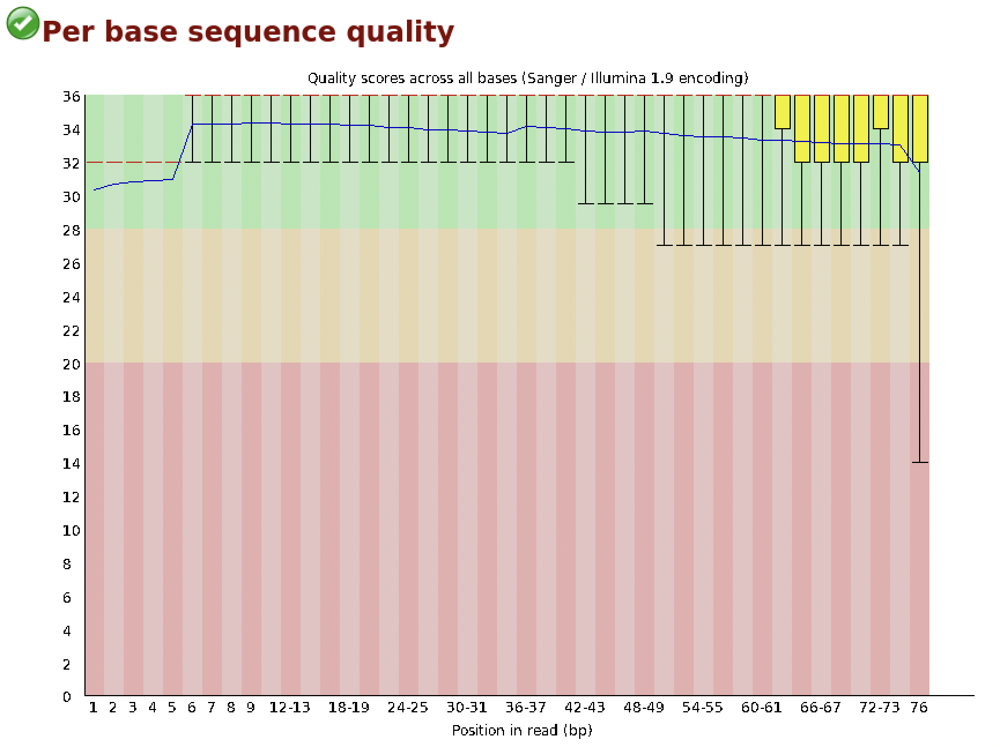
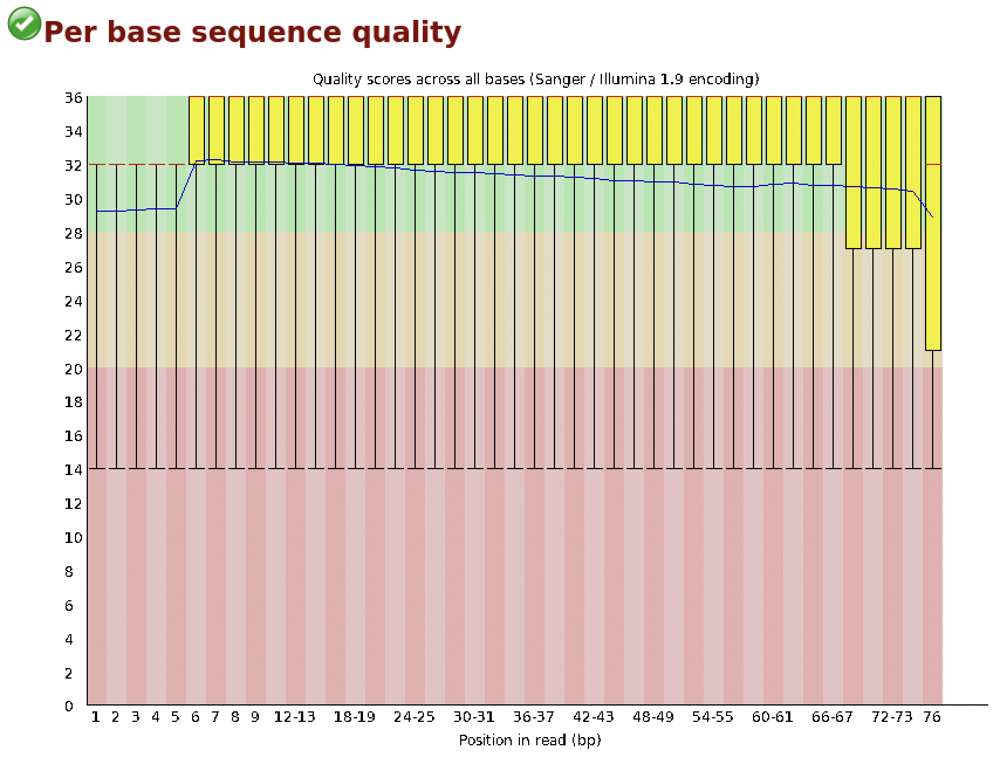
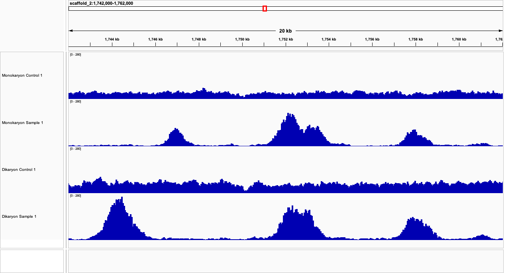
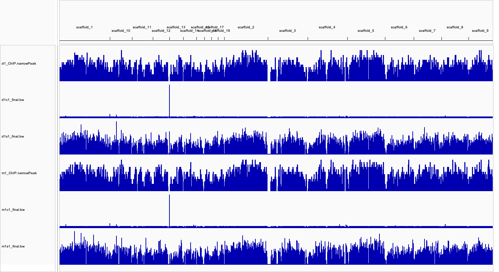

```{r setup, include=FALSE}
knitr::opts_chunk$set(echo = TRUE)
```

# Introduction

The fruiting bodies of mushrooms, most conspicuously basidiomycete fungi, are the sexual structures that produce spores for mushroom reproduction. The fleshy, spore-bearing bodies are of economic value due to their use as food [\@kues2000fruiting]. Moreover, mushrooms can also produce enzymes used for bioconversions such as lignocellulosic degradation [\@de2016good]. In this report we assess the results of HEK4me2 ChIP-Seq in a model mushroom organism, Schizophyllum commune, done by Peter Jan Vonk and Robin A. Ohm [\@vonk2021h3k4me2].

The basidiomycete S. commune can be found on all continents except for Antarctica, making it one of the most commonly found fungi. It is predominantly found on fallen deciduous trees, adopting a saprobic lifestyle by causing white rot [\@schmidt1980variability]. Thus, S.commune is an excellent basidiomycete model organism for mushroom development [\@ohm2010genome].

In the lab, S.commune has a well-defined lifecycle of 10 days [\@ohm2010genome]. The lifecycle of S.commune begins with meiospores that germinate beneath the surface of the substrate to form monokaryotic mycelium [\@wosten2006emergence]. A few days following germination, the formation of aerial hyphae occurs. Monokaryotic aerial hyphae that encounter each other fuse, and if alleles of the mating-type loci matA and matB differ between partners, fertile dikaryons can form. Mushroom formation begins through the aggregation of aerial dikaryotic hyphae. Upon the formation of mature fruiting bodies, karyogamy and meiosis occur in the basidia and the basidiospores are released to give rise to new monokaryotic mycelium [\@wosten2006emergence].

Transcriptomics and comparative genomics of S.commune have revealed elements for a regulatory model of mushroom development [\@pelkmans2017transcription,\@vonk2018role,\@krizsan2019transcriptomic]. However, the role of epigenetic regulation in S.commune remains undiscovered. In the work completed by Peter Jan Vonk and Robin A. Ohm, a method for histone ChIP-Seq in S. commune was developed and the distribution of H3K4me2 in the genome was mapped during monokaryotic and dikaryotic development [\@vonk2021h3k4me2]. 4-day old monokaryotic and dikaryotic S. commune colonies were grown, and ChIP-Seq was performed on biological duplicates. Colonies were collected and samples were crosslinked in 1% formaldehyde using vacuum infiltration in Tris-buffer saline, and crosslinking was quenched by 0.125 M glycine. The crosslinked samples were dried and frozen in liquid nitrogen to be homogenized for DNA extraction. Extracted chromatin was fragmented by sonication, and isolated chromatin was collected either for ChIP or storage at -80C for use as the input control. The ChIP pull-down was performed with an anti-H3K4me2 antibody and Pierce Protein A Magnetic Beads (ThermoFisher Scientific, MA, USA). The input controls were de-crosslinked under the same conditions, with the exclusion of anti-H3K4me2 antibody. This yield two biological replicate of monokaryotic and dikaryotic ChIP-Seq samples and their corresponding input controls [\@vonk2021h3k4me2]. The resulting DNA was sequenced and aligned to the S. commune H4-8 (version Schco3) genome assembly [\@ohm2010genome].

# Methods and Results

Following the methods described by Peter Jan Vonk and Robin A. Ohm, the reproducibility of the H3K4me2 ChIP-Seq results were assessed [\@vonk2021h3k4me2].

## Data Retrieval

Reference genome of S.commune Schco3 and gene annotation was provided by Robin A. Ohm, the original author of the paper. The reference genome and gene annotation files came as a .fasta and .gff3 file format respectively. ChIP sequences of monokaryon and dikaryon samples and their corresponding input controls were retrieved through cloud data delivery from SRA selector database from ID: PRJNA702885. A total of 8 directories were received: 4 sample directories (sample 1 and 2 of each monokaryon and dikaryon), and 4 control directories (control 1 and 2 of each monokaryon and dikaryon). Each directory contains paired-end reads in .fastq.gz format with each run split into 4 separate lines. Only monokaryon and dikaryon Sample 1 their corresponding input controls were used for this report due to storage limitations.

## Quality Control: FastQC

To assess the quality of the library, fastq files retrieved from the SRA were run through FastQC [\@464]. The html report of the quality of data was reviewed.

 Figure 1. Example per base sequence quality read chart of paired-end run 1 for first fastqc file of monokaryon sample 1.

 Figure 2. Example per base sequence quality read chart of paired-end run 2 for first fastqc file of monokaryon sample 1.

## Index Builds and Alignment

Schco3 reference genome was built using the Bowtie2 (v2.4.5) bowtie2-build function [\@langmead2012fast].

    bowtie2-build Schco3.assembly.fasta Schco3_index

As a result, a pipeline was written as a shell script to align the ChIP sequences to the reference genome.

    refDir=\$1 
    sampleDir=\$2

    for sample in "\$sampleDir"; do 
      for dirname in $(ls "$sample"); 
      do echo "aligning ${dirname}" 
      bowtie2 --sensitive-local -x "$refDir"/"scho3_index" -1 "$sample"/"$dirname"/"$dirname"_L001_R1_001.fastq,"$sample"/"$dirname"/"$dirname"\_L002_R1_001.fastq,"$sample"/"$dirname"/"$dirname"_L003_R1_001.fastq,"$sample"/"$dirname"/"$dirname"\_L004_R1_001.fastq -2 "$sample"/"$dirname"/"$dirname"_L001_R2_001.fastq,"$sample"/"$dirname"/"$dirname"\_L002_R2_001.fastq,"$sample"/"$dirname"/"$dirname"_L003_R2_001.fastq,"$sample"/"$dirname"/"$dirname"\_L004_R2_001.fastq -S "\$dirname"\_aligned.sam 
      done; 
    done

Alignment was done using the sensitive local option in Bowtie2 [\@langmead2012fast]. When “local” is specified in Bowtie2, it performs local read alignment rather than the default end-to-end alignment. In this mode, Bowtie2 may soft clip read characters from the read ends to optimize the alignment score. The sensitive local option is a Bowtie2 preset, which is the same as using the following flags: -D 15 -R 2 -N 0 -L 20 -i S,1,0.75 where: -D sets the number of failed consecutive seed extension attempts before Bowtie2 moves on -R sets the maximum number of times Bowtie2 re-seeds reads with repetitive reads -N sets the number of mismatches allowed during multiseed alignments -L sets the length of the seed substring aligned in multiseed alignment -i sets the function governing the interval between seed substrings to f(x) = 1 + 0.75\*sqrt(x) in multiseed alignment. By using this preset, the alignment is more sensitive by making the seeds closer together (-i) and the seeds shorter (-L) than the default settings, while allowing no mismatches (-N) [\@langmead2012fast].

## Pre-Processing of Mapped Reads

After alignment, the SAM files were converted into BAM files using SAMtools (v1.15.1) [\@li2009sequence].

    samtools view -S -b -h monokaryon_s1_aligned.sam > monokaryon_s1_aligned.bam

The flags indicate that the input is a SAM file (-S), the output is a BAM file (-b), and the header should be preserved (-h). When using samtools view, the -h flag must be specified for the program to preserve the header.

Following SAM to BAM conversion, reads with the quality scores less than 1 were filtered out using SAMtools [\@li2009sequence].

    samtools view -h -Bq 2 monokaryon_s1_aligned.bam > monokaryon_s1_aligned.filtered.bam

The -Bq 2 flag is used to keep scores that are greater than or equal to 2, which in this case are scores that are greater than 1. Next, filtered samples and controls were sorted using the samtools sort function. By default, samtools sort reads the source BAM and sorts them by coordinate [\@li2009sequence].

    samtools sort monokaryon_s1_aligned.filtered.bam -o monokaryron_s1_aligned.filtered.sorted.bam

Samtools sort does not require an -h flag to preserve the header [\@li2009sequence]. Sorting the BAM file by coordinate allows us to do meaningful analysis such as visualising the alignments in IGV and using the MarkDuplicates function in Picard. The MarkDuplicates function in Picard (v2.26.11) identifies duplicate reads by comparing sequences in the 5 prime position of read pairs in a BAM file. The main output is a new BAM file where the duplicates are marked with a hexadecimal 0x400 flag [\@Picard2019toolkit].

    java -jar /home/bmeg/anaconda3/envs/bmeg-project/share/picard-2.26.11-0/picard.jar MarkDuplicates -I Monokaryon_s1_aligned.filtered.sorted.bam -O Monokaryon_s1_aligned_marked.bam -M Monokaryon_s1_metrics.txt -AS -TAGGING_POLICY OpticalOnly

Because the BAM files were sorted using SAMtools, the -AS field was invoked. This argument allows Picard to assume that the input file is coordinate sorted even if it is not indicated in the header. The addition of “-TAGGING_POLICY OpticalOnly” instructs the program to mark optical duplicates only [\@Picard2019toolkit]. The optical duplicates were removed using samtools view [\@li2009sequence].

    samtools view -h -F 0x400 monokaryon_s1_aligned_marked.bam -o m1s1_final.bam

By invoking the -F and specifying the 0x400 flag, a final BAM file that excludes the optical duplicates was generated [\@Picard2019toolkit].

```{r}
read_comparison <- data.frame(paper_raw_read=c('13,832,046', '9,598,100', '21,339,686 ', '14,540,244 '),
                              paper_filtered_read=c('12,104,966 ', '8,973,684', '19,391,294  ', '13,356,868'),
                              raw_read = c('12,680,531 ', '9,363,872', '20,238,309', '13,863,951'),
                              filtered_read = c('11,791,518', '8,980,698', '18,862,865', '13,325,986'))
row.names(read_comparison) <- c("Monokaryon Control 1","Monokaryon Sample 1","Dikaryon Control 1", "Dikaryon Sample 1")
colnames(read_comparison) <- c("Raw read Count (Paper)", "Filtered Read Count (Paper)", "Raw Read Count", "Filtered Read Count")
knitr::kable(read_comparison)
```

Table 1. Comparison of pre-processing and filtering read counts from Vonk and Ohm (Paper) and ours.

According to Vonk and Ohm, between 9.6 and 21.3 million paired end 75 bp reads were obtained prior to pre-processing [\@vonk2021h3k4me2]. In comparison, our alignment yielded 2.4 to 8.3% less reads at 9.4 to 20.2 million before preprocessing steps (Table 1). After removing low quality, unmapped, and optical duplicate reads, we found that our values matched closer with those reported by Vonk and Ohm. Vonk and Ohm reported between 9.0 to 19.4 reads remaining following the alignment processing [\@vonk2021h3k4me2], whereas our filtering resulted in 9.0 to 19.0 million reads remaining (Table 1) . This yielded a difference of 0.8 to 2.7% from the reported results. Vonk and Ohm saw 6 to 12.5% of reads discarded [\@vonk2021h3k4me2], while our alignment saw less reads discarded at 4 to 7%.

## Creating Bigwig files for IGV

Bigwig files are indexed files that can be used for visualizing signals across the genome in programs such as IGV. First, BAM index files were created from our final processed ChIP files using Sambamba (v0.8.2) [\@Tarasov2015sambamba].

    sambamba index -p d1s1_final.bam 

The -p flag was used to show the progress of the index formation. Once the BAM indexes were formed ( .bam.bai), Deeptools (v3.5.1) bamCoverage was used to convert the final processed BAM files into bigwigs files, where the -b flag indicates a BAM file input, and the -o flag specifies the output [\@ramirez2016deeptools2].

    bamCoverage -b d1c1_final.bam -o d1c1_final.bw

Upon visualization of the bigwig files, we found that our reproduced ChIP-samples matched that of Vonk and Ohm [\@vonk2021h3k4me2], whereas the input control did not. The ChIP-samples revealed concentrated peaks representing the binding sites of H3K4me2. To confirm this, we observed scaffold 2: 1,742,000 – 1,762,000. Scaffold 2: 1,742,000 – 1,762,000 was identified by Vonk and Ohm with enriched H3K4me2 peaks that were verified for gene expression using RT-qPCR [\@vonk2021h3k4me2].



Figure 3. IGV visualization of filtered reads at Scaffold 2: 1,742,000 – 1,762,000.

## Peak Calling and Distribution

Monokaryon and dikaryon sample peaks were called using MACS2:

    macs2 callpeak -t m1s1_final.bam -c m1c1_final.bam -g 3.7e+8 --outdir m1_ChIP_updated

where “-t” is the flag for input file, “-c” is the control file, “-g” is the proposed genome size, and “--outdir” is the output directory. A genome size of 3.7x10e+8 was used according to the supplementary document provided by the original authors. As a result, 6501 peaks were found for monokaryon sample 1 and 6216 peaks were found for dikaryon sample 1. In comparison to the original paper, Vonk and Ohm recorded 6032 and 5889 significant peaks in the monokaryotic and dikaryotic colonies. Using the .narrowpeaks file, we visualised the peaks on IGV along with the reference genome and sequence samples.



Figure 4. IGV visualization of called peaks with respect to fungal colony samples and controls.

Unlike the ChIP-samples, we found the input control to have mapped differently to the reference genome compared to the input control results of Vonk and Ohm. Vonk and Ohm found that the input controls displayed similar read coverage along the genome [\@vonk2021h3k4me2]. When visualized on IGV, our input controls revealed an exaggerated signal across a 3.5 kb stretch at the coordinates scaffold 13:1-3,500 on both monokaryotic and dikaryotic input control tracks.

After peaks were called, we used ChIPseeker to visualise the distribution of peaks along scaffolds in each monokaryon and dikaryon samples [\@yu2015chipseeker]. The number of peaks are shown to distribute evenly across the genome. Also, the peaks per scaffold is shown to decrease from scaffold 1 - 23.

```{r}
# load libraries
library(ChIPseeker)
library(clusterProfiler)
library(GenomicFeatures)

# load in data
peaks_data = GenomicRanges::GRangesList(mono_data = readPeakFile("m1_ChIP_updated.bed"),
                                           di_data = readPeakFile("d1_ChIP_updated.bed"))
# Make Coverage plot over each scaffold
num_scaffolds <- 1:23
scaffold_list <- c(sprintf("scaffold_%d",num_scaffolds))

# plot coverage plot
library(ggplot2)
col <- c(mono_data = 'red', di_data = 'green')
mono_coverage <- covplot(peaks_data, weightCol = "V5", chrs = scaffold_list)
mono_coverage + facet_grid(chr ~ .id) + scale_color_manual(values = col) + scale_fill_manual(values = col) 
```

Figure 4. H3K4me2 Peak distribution during S.Commune fungal colonies. Left (green) is the dikaryotic colony and right (red) is the monokaryotic colony.

Next, we reproduced the same analysis of localizing peaks with respect to genes. This was done using ChIPseeker's plotAvgProf function to plot the read/peak frequency count profile +-3kb away from the transcription initiation site (TIS). To do this, we first converted the gene annotation file (.gff3) and converted it into txdb file for finding gene references. Then, a tag matrix is created which is a summarized matrix containing the peak count frequency based on the tagged start of the transition initiation site. Both monokaryon and dikaryon samples had its tag matrix computed and its profile visualized.

```{r}
# Calculate matrix for TSS region binds

# load in gff3 file for gene annotation translation to txdb
txdb <- makeTxDbFromGFF(file = "Schco3_gene_features.gff3")

# for monokaryon
mono_tagMatrix <- getTagMatrix(peak = peaks_data$mono_data, 
                          TxDb = txdb,
                          upstream = 3000,
                          downstream = 3000,
                          type = "start_site",
                          by = "gene")
mono_plot <- plotAvgProf(tagMatrix = mono_tagMatrix, xlim = c(-3000,3000),)

# for dikaryon
di_tagMatrix <- getTagMatrix(peak = peaks_data$di_data, 
                          TxDb = txdb,
                          upstream = 3000,
                          downstream = 3000,
                          type = "start_site",
                          by = "gene")
dikary_plot <- plotAvgProf(tagMatrix = di_tagMatrix, xlim = c(-3000,3000))

mono_data <- mono_plot$data
di_data <- dikary_plot$data

data_plot <- ggplot(data = mono_data, aes(x=pos)) + 
            geom_line(aes(y=mono_data$value, color = "Monokaryon"),linetype = "dashed") + 
            geom_line(aes(y=di_data$value, color = "Dikaryon"),linetype = "dashed") + 
labs(x = "Genomic Region (5'->3') (bp)", y = "Read Count Frequency", title = "Read Count Distribution near TSS", legend.position = 'top right')

data_plot + scale_colour_manual("", values = c('Monokaryon' = 'red','Dikaryon' = 'blue'))

```

Figure 5. Peak distribution across developing fungal colonies around 3 kb upstream and downstream from transcription site.

From the figure above, peak enrichment range from start of transcription site to approximately 350 bases downstream of the TIS. In contrast to the original paper, the enrichment ranged from 375 bp upstream to 1500 bp downstream. Additionally, the correlation between samples is around 0.31.

```{r}
sample_cor <- cor(mono_data$value,di_data$value)
sample_cor
```

# Discussion

The purpose of this project was to replicate the peak distribution results from vonk and ohm using convential bioinfomratics tools. Using the methods outlined in the published article as well as the supplementary information, a preprocessing pipeline for the mapped reads was proposed and the parameters for alignment and filtering were extrapolated where needed. Ultimately, our porposed pipeline achieved similar sequence mapping results to those reported by Vonk and Ohm up until the the visualisation of the sequence distribution across the genome in IGV. Although our reproduced Chip-seq samples macthed the published data, visualization of the input controls revealed an significant enrichment signal at Scaffold 13: 1-3500. This highly enriched signal in the input controls were not reported in the published results. To ensure that the disproportionate signal was not due to insufficient duplicate read identification, the samples were remarked for all types of duplicates instead of optical duplicates only to be filtered. This did not affect the appearance of the highly enriched signal. This may suggest that the signal is composed of multi mapped reads. When added to the size of the signal, and its likeness between the two input controls, this may be an artifact region that should be removed. Because accuracy in peak calling is essential for downstream ChIP-Seq analysis, it has become common practice to removed regions with artifact signals using ENCODE blacklists [\@amemiya2019encode]. And filtering of alignments in these problematic regions is usually done before application of any normalization, or peak calling, as they can dramatically bias results [\@carroll2014impact]. Thus, the highly enriched signal on scaffold 13 could have led to a noisy profile in Figure 5 However, Volk's and Ohm's publication is the first report of the use of ChIP-Seq in a mushroom-forming basidiomycete. Thus an ENCODE blacklist for S.commune is not yet available to confirm if signals in Scaffold 13: 1-3500 should be excluded. Due to time and storage limitations, we were unable to test alternative alignment parameters such as end-to-end reading, and different read lengths. Regrettably, the creation of an ENCODE blacklist requires a significant amount of input data and a significant amount of RAM and disk storage based on the size of the genome analyzed and the number of input data files being processed.

# Contributions

Ariel Huynh wrote the introduction and part of the discussion; Jason Fung wrote part of the methods and part of the discussion. Computational work was split 50/50, where Ariel performed the alignment and filtering sam -> bam files and Jason did the ChIP peak distribution and IGV visualizations.

# Acknoledgements

We would like to thank Drs. Peter Jan Vonk & Robin A. Ohm for their help with providing us the reference genome files and gene annotation file.

# References
